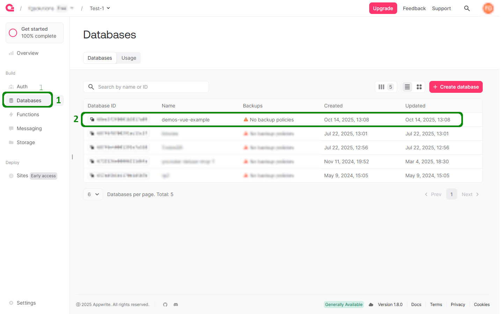
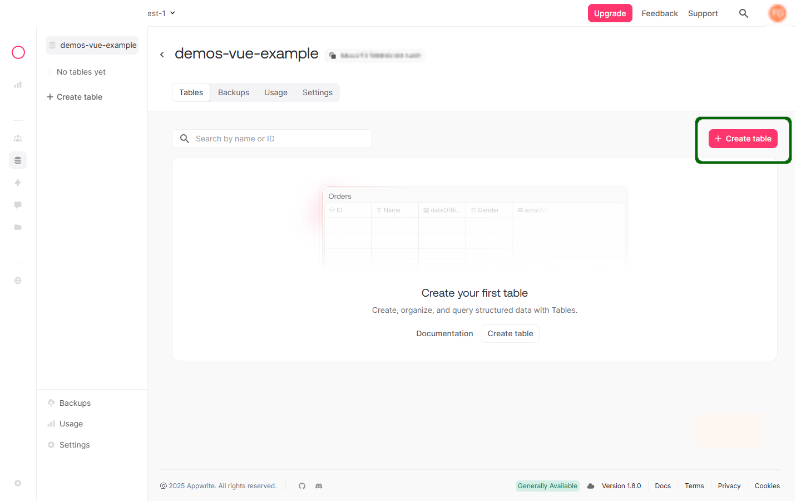
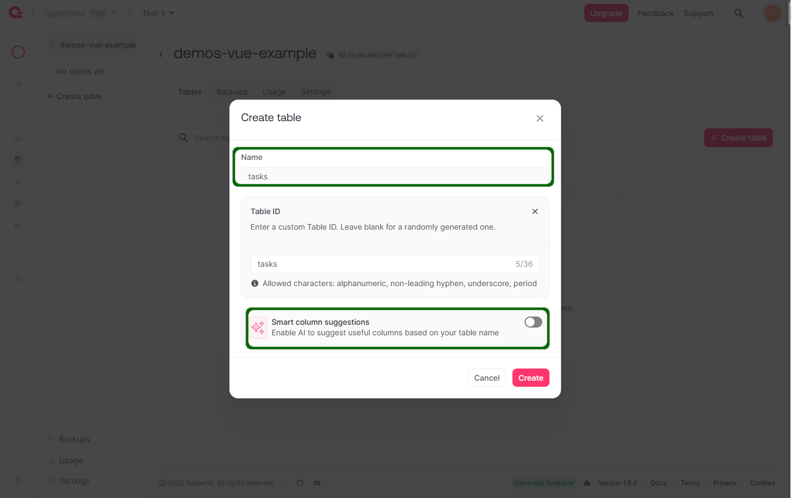
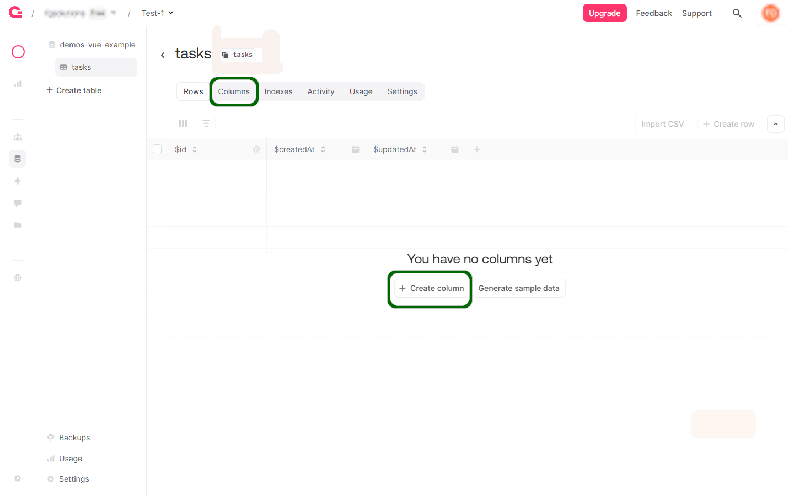
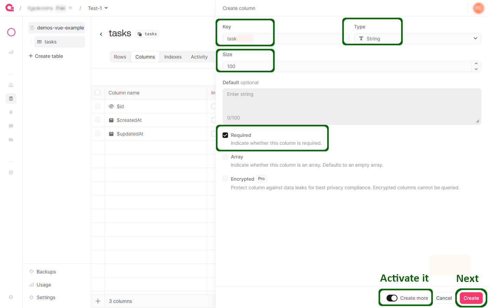
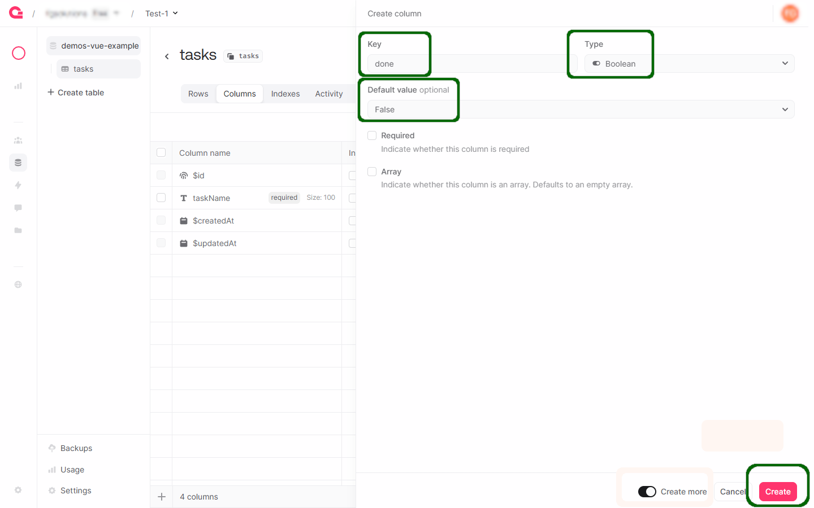
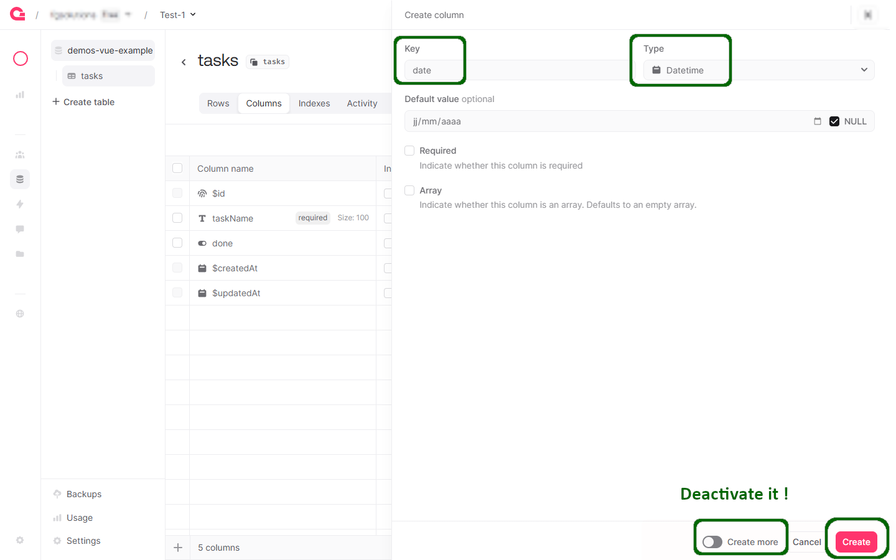
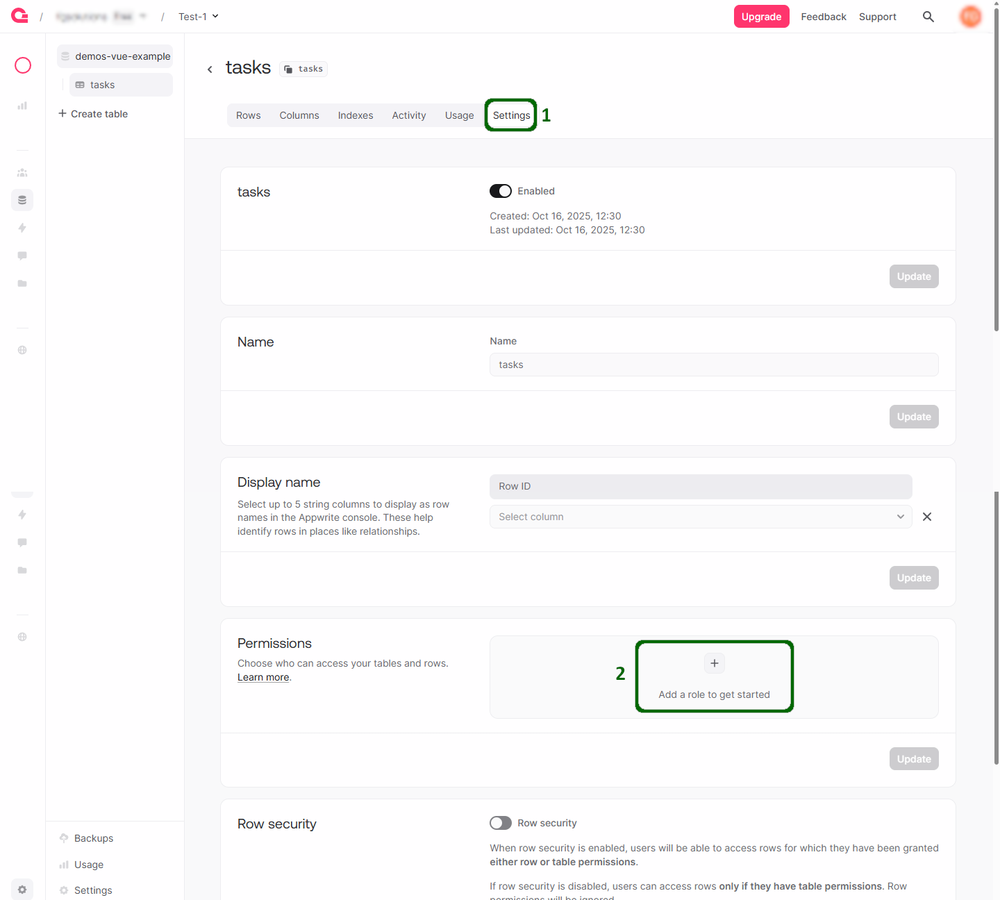
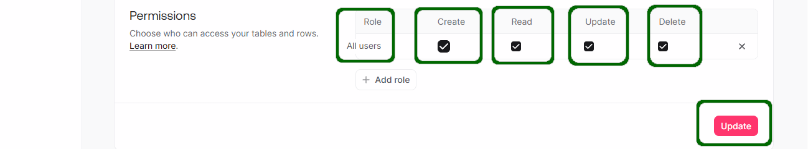

# Appwrite + VueJS =❤️
This example is to showcase [Appwrite's JS API](https://github.com/appwrite/sdk-for-js) with [VueJS](https://vuejs.org/) by creating a simple tasks web application where you can add, remove and mark tasks as done.

## Prerequisites

-   A recent version of [NodeJS](https://nodejs.org/)
-   [Yarn](https://yarnpkg.com/) (Feel free to use [NPM](https://www.npmjs.com/) if you want to, just switch out the Yarn Commands for their NPM counterparts)
-   [A locally running Appwrite instance](https://appwrite.io/docs/installation).

## Getting Started
You have two options to get started, either using yarn or pnpm...
### With yarn 
To get started as fast as possible we will use the Vue CLI, Here we will use NPX to launch the Vue CLI without installing it globally.
``` shell
npx @vue/cli create --default example-database
```
that should create an app with Vue 3, Babel and ESLint, while we are in the terminal we might as well install the appwrite SDK for later using:
```shell
yarn add appwrite
```
With that done go ahead and launch the development server on `localhost:8080` using:
``` shell
yarn serve
```
### With pnpm
We don't need Babel here.
First, we need to install the Vue CLI globally using pnpm:
``` shell
pnpm install -g @vue/cli
```
Next, we will create a new VueJS project using the CLI:
``` shell
vue create example-database
```
With that done go ahead and launch the development server on `localhost:5173` using:
``` shell
pnpm dev
```
## Housekeeping and The Appwrite SDK
First, we want to remove the default components contained within the boilerplate app we just created.

 1. Delete the `src/components/HelloWorld.vue` component
 2. Replace the code in `src/App.vue` to the following, using the Composition API of Vue :
 ```html
 <template>
   <div></div>
</template>

<script setup>
</script>

<style>
</style>
 ```

## Preparing data on Appwrite backend

In order for us to create this to-do app we need a place to store it. We need to first create a table in our appwrite database for this app to use.
**Note** : 
- *table* are  was called *collection* in appwrite <1.8. 
- Further down you will see the *collectionId* attribute which corresponds to the *name* of the table.


First, we want to navigate to our appwrite control panel and login, then navigate to the left side bar Database, and then click the base you want.



Once there go ahead and click on the `+ Create table` icon on the right.



Name the table as you wish ("table" is the equivalent of a 'collection' on previous versions of appwrite), you must refuse the *smart column suggestion* (AI generation option). **Take note** of the table name for later.



Next, we are going to create the schema of the table by defining the table's columns : Go ahead and navigate to `Columns` tab, and click to `+ Create column`



Add these three columns:



  



  



  

Finally, we are going to allow read, write, update access to *any* (everyone), this is because we don't want to have to sign in to add these tasks and read them.

⚠️ **Note :** you do not want to do this in a public web app powered by appwrite. We **are only doing this for ease of use while developing** this project.



  



### 2) Define the constants in `.env`
Next, we are going to create a .env file in the root of the project, this is where we will store our appwrite credentials so we can easily access them throughout our app without hardcoding them into our code (Vite-style variables):

```
VITE_DB_ENDPOINT='<YOUR OWN APPWRITE ENDPOINT>'
VITE_DB_PROJECTID='<YOUR OWN APPWRITE PROJECTID>'
VITE_DB_DATABASEID='<YOUR OWN APPWRITE DATABASEID>'
VITE_DB_TABLENAME='<YOUR OWN APPWRITE TABLE NAME>'
```

The app reads these via `import.meta.env` (see `src/secrets.js`) and uses them in `src/utils.js` to initialize Appwrite.

### 3) Creating the fetch code
Use a `ref` to hold tasks and an `onMounted` hook to fetch them. Example in `src/App.vue` `<script setup>`:

```js
import { ref, onMounted } from 'vue'
import { appwrite } from './utils'
import { SECRETS } from './secrets'

const tasks = ref([])
const newTask = ref('')

const fetchTasks = async () => {
  try {
    const res = await appwrite.database.listDocuments(
      SECRETS.DB.databaseId,
      SECRETS.DB.tableName
    )
    tasks.value = res.documents || []
  } catch (err) {
    console.error('fetchTasks error', err)
  }
}

onMounted(fetchTasks)
```

Notes:
- `SECRETS` is a small wrapper around `import.meta.env` (see `src/secrets.js`).
- `appwrite` is created in `src/utils.js` and exposes `database`, `account`, etc.

### 4) Writing the App template
Use the Composition API state in the template. Example template extract for `src/App.vue`:

```html
<template>
  <div class="TaskCore">
    <h1>Appwrite TO-DO List</h1>

    <!-- Render Task components -->
    <div v-for="data in tasks" :key="data.$id || data.task">
      <Task :data="data" @refreshData="fetchTasks" />
    </div>
    <div class="newTaskForm">
      <input v-model="newTask" placeholder="Add New Task" />
      <button @click.prevent="createNewTask"><span>+</span></button>
    </div>
  </div>
</template>
```

### 5) code for `createNewTask()` 
This function validates the input, creates a document and refreshes the list:

```js
const createNewTask = async () => {
  if (!newTask.value.trim()) return

  try {
    // Here we don't use a transaction for a single document creation, it could be useful mostly when multiple operations are needed (CF https://appwrite.io/docs/products/databases/transactions)
    await appwrite.database.createDocument(
      SECRETS.DB.databaseId,
      SECRETS.DB.tableName,
      'unique()',
      {
        task: newTask.value,
        done: false,
        date: new Date()
      },
    )
    newTask.value = ''
    await fetchTasks()
  } catch (error) {
    console.error('createNewTask error', error)
  }
}

```

### 6) Creating our custom Task component
Create `src/components/Task.vue` using `<script setup>` and props. Template and script example:

```html
<template>
  <div class="taskComponent" @click.self="doneTask"><!-- Update a task -->
        <div @click.self="doneTask" :class="['taskName', done ? 'taskDone' : '']">{{ props.data.task }}</div>
        <div class="taskDelete" @click.stop="deleteTask"><span></span></div><!-- Delete a task -->
    </div>
</template>

<script setup>
import { ref, watch } from 'vue'
import { appwrite } from '../utils.js'
import { SECRETS } from '../secrets.js'

const props = defineProps({
    data: { type: Object, required: true } // Prop to receive task data from parent
})
const emit = defineEmits(['refreshData']) // Emit event to parent to refresh data

// Reactive copy for "done" state (optimistic UI)
const done = ref(!!props.data.done)

// Keep local stat synchronized with props, when parent is updated
watch(() => props.data.done, (v) => {
    done.value = !!v
})

const deleteTask = async () => {
    try {
        await appwrite.database.deleteDocument(
            SECRETS.DB.databaseId,
            SECRETS.DB.tableName,
            props.data.$id,
        )
        emit('refreshData')
    } catch (error) {
        console.error(error)
    }
}

const doneTask = async () => {
    const newDone = !done.value
    // Update of optimistic UI
    done.value = newDone
    try {
        await appwrite.database.updateDocument(
            SECRETS.DB.databaseId,
            SECRETS.DB.tableName,
            props.data.$id,
            { done: newDone },
        )
        emit('refreshData')
    } 
    catch (error) {
      console.error(error)
      // Reverse on error
      done.value = !newDone
    }
}
</script>
```

### 7) Add code for `deleteTask()`
See the `deleteTask` function above — it calls `appwrite.database.deleteDocument(collectionId, documentId)` then emits `refreshData` so the parent re-fetches tasks.

### 8) Go ahead and style the Task component
Example minimal CSS (put in the `<style>` block of `src/components/Task.vue`):

```css
<style>
    .taskComponent {
        margin: 0 auto;
        margin-top: 15px;
        margin-bottom: 15px;
        position: relative;
    }

    .taskName {
        width: calc(100% - 40px);
        width: 70%;
        box-shadow: 0px 0px 10px black;
        height: 50px;
        border-radius: 10px;
        margin: 0 auto;
        line-height: 50px;
        font-size: 25px;
        transition: 0.2s;
    }

    .taskComponent:hover .taskName {
        text-decoration: line-through;
        cursor: pointer;
        color: #535353;
    }

    .taskDone {
        text-decoration: line-through;
        color: #535353;
    }

    .taskDelete {
        position: absolute;
        width: 40px;
        height: 40px;
        background-color: #f85353;
        right: 20px;
        top: 50%;
        transform: translateY(-50%);
        border-radius: 10px;
        transition: 0.5s;
        color: white;
    }

    .taskDelete > span {
        position: absolute;
        left: 50%;
        top: 50%;
        height: 5px;
        background-color: white;
        width: 20px;
        transform: translateX(-50%) translateY(-50%);
    }

    .taskDelete:hover {
        box-shadow: 0px 0px 10px black;
        scale: 1.05;
        cursor: pointer;
    }
</style>
```

### 9) Wrapping it all up
- Import the `Task` component into `src/App.vue` and register/consume it in the template (with `v-for` and `@refreshData` as shown above).
- The flow is:
  1. App mounted -> `fetchTasks()` -> fills `tasks` ref.
  2. Each task is rendered by `Task` component.
  3. `Task` emits `refreshData` after delete or done -> parent re-fetches.
  4. `createNewTask()` adds a document then re-fetches.

Verification tips:
- Start dev server and open the console to confirm `fetchTasks` returns documents.
- If permissions errors occur, check the table read/write/update/delete settings in Appwrite and your `.env` values.

## Congratulations! 🥳🥳🥳

You have just completed the example todo app with appwrite and Vue 3 ! You should now have enough knowledge in order to use Databases with Appwrite and VueJS and if you have any more questions do not hesitate to contact us on [Discord](https://discord.gg/ZFwqr3S) and if you notice any errors with this tutorial then feel free to raise an Issue or PR in the [GitHub of this tutorial](https://github.com/appwrite/demos-for-vue/)

  

Thank you for following the tutorial from all of us at the Appwrite Team.